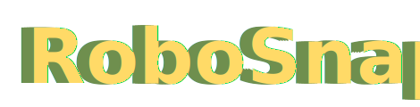

<h1 align="center">
  
</h1>

<p align="center">One-Shot Real-to-Sim Scene Generation for Generalizable Robot Learning and Evaluation</p>

<p align="center">
  <a href="https://robosnap.github.io">Website</a> |
  <a href="robosnap/paper.pdf">Paper</a>
</p>

<p align="center">
  
</p>


RoboSnap reconstructs real-world scenes into simulation-ready assets from single RGB images, and the full implementation also supports short videos as input. Our **GUI tool** supports interactive segmentation, mask workspace management, mask-to-3D asset generation, scene composition, and articulated-object refinement. We also provide **a fully automatic pipeline** that transforms a single image into a layered simulation-ready scene with object assets and background context within around **20 minutes**.

More components from the paper, including **evaluation code**, **real-robot deployment code**, and the **DROID-Sim** dataset will be released soon **this month (07/26)**. Stay tuned!


## Release Plan

- [x] GUI tool
- [ ] Fully automatic layered scene generation pipeline
- [ ] Real-robot deployment tutorial
- [ ] Evaluation code
- [ ] DROID-Sim dataset


## Environment

### Docker

Prerequisites on the host:

```bash
docker version
nvidia-smi
docker run --rm --gpus all nvidia/cuda:12.1.1-base-ubuntu22.04 nvidia-smi
```

Clone and enter the repo:

```bash
git clone https://github.com/robosnap/robosnap.git
cd robosnap
```

Build the image:

```bash
docker build -t robosnap-gui:local .
```

Run a dry launch first. This checks path resolution and prints the GUI command without starting Gradio:

```bash
docker run --gpus all --rm -it \
  -e DRY_RUN=1 \
  -v "$(pwd)/checkpoints:/workspace/robosnap/checkpoints" \
  -v "$(pwd)/outputs:/workspace/robosnap/outputs" \
  robosnap-gui:local
```

Start the GUI:

```bash
docker run --gpus all --rm -it \
  --ipc=host --shm-size=16g \
  -p 7897:7897 \
  -v "$(pwd)/checkpoints:/workspace/robosnap/checkpoints" \
  -v "$(pwd)/outputs:/workspace/robosnap/outputs" \
  robosnap-gui:local
```

Open:

```text
http://127.0.0.1:7897
```

The default input video is `examples/video.mp4`. The default output workspace is `outputs/example/multi_mask`.

### Conda


Use this path when Docker is unavailable or when you want to debug the repo directly. The launcher supports three Python runtimes: GUI/video segmentation, mask-to-3D asset generation, and the Articulate Tool.

Install the native conda environments with the helper script:

```bash
bash scripts/install.sh
```

The script creates `robosnap-gui`, `robosnap-asset`, and `robosnap-articulate`, then writes `configs/gui.env` so `bash scripts/run_gui.sh` uses the new envs.

After installation:

```bash
bash scripts/run_gui.sh
```


## GUI

The pipeline of our GUI tool includes:

1. Upload a video/image.
2. Add text prompt and positive and negative prompt points.
3. Confirm, preview and save masks.
4. Generate GLB assets and compose a scene.
5. (Optional) Articulated objects segmentation.


<p align="center">
  
</p>

The GUI provides the recommended workflow for mask refinement and asset generation. The mask-to-assets stage can also be executed from an existing mask workspace using:
`scripts/gui/bash/run_mask_to_assets.sh`.

> **Note:** For multi-view asset generation using the top-20 mask candidates, we recommend a GPU environment with at least **48GB of VRAM** to ensure smooth execution.

### Online Demo

We provide an online Gradio demo to showcase the capabilities of the RoboSnap GUI tool.
You can access the demo [here](https://0a1b81dfcc87953981.gradio.live). Please note that this hosted demo is intended as a **lightweight preview** of the full GUI tool and may experience delays or temporary unavailability under heavy traffic. For the most stable and complete experience, we recommend cloning our repository and running the GUI locally.


## Checkpoints

Model weights are not committed. `checkpoints/` is the default local mount point and is git-ignored except for `.gitkeep`.

To preview or run Hugging Face downloads, use the checkpoint helper. Private or unreleased checkpoint repos must be passed explicitly:

```bash
python3 scripts/gui/python/download_checkpoints.py --dry-run --skip-optional
python3 scripts/gui/python/download_checkpoints.py --sam3d-repo <your-sam3d-checkpoint-repo>
```

## Configuration

RoboSnap can be configured through `configs/gui.env`.

Create a local configuration file if you need to override default paths:

```bash
cp configs/gui.env.example configs/gui.env
```


## Folder Structure

The GUI writes a workspace including `multi_mask/` and `single_mask/`:

```text
outputs/example/
  multi_mask/
    video.mp4
    segmented_video.mp4
    background/
      000000.png
    object_name_a/
      all_mask/
      top20_mask/
      object_name_a.glb
      object_name_a_joints.json
      object_name_a_joints.usd
  single_mask/
    image.png
    0.png
    0.glb
    scene_composed.glb
```

## License

The RoboSnap source code is released under the Apache License 2.0.
See the [LICENSE](LICENSE) file for details.

## Third-Party Code and Models

RoboSnap includes adapted third-party components under `third_party/`.
Each component remains subject to its original license and attribution
requirements. Please refer to the corresponding subdirectory for details.

Model checkpoints are not included in this repository and may be subject
to their respective licenses from the original authors.
