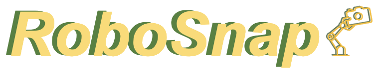
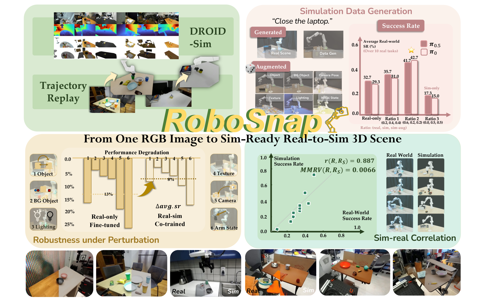
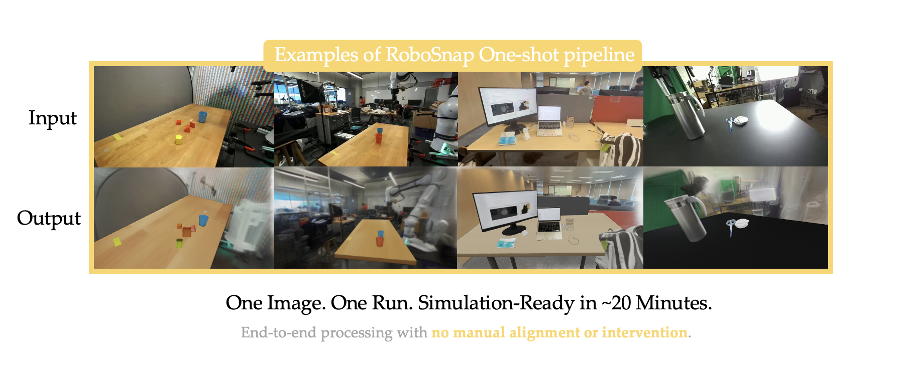
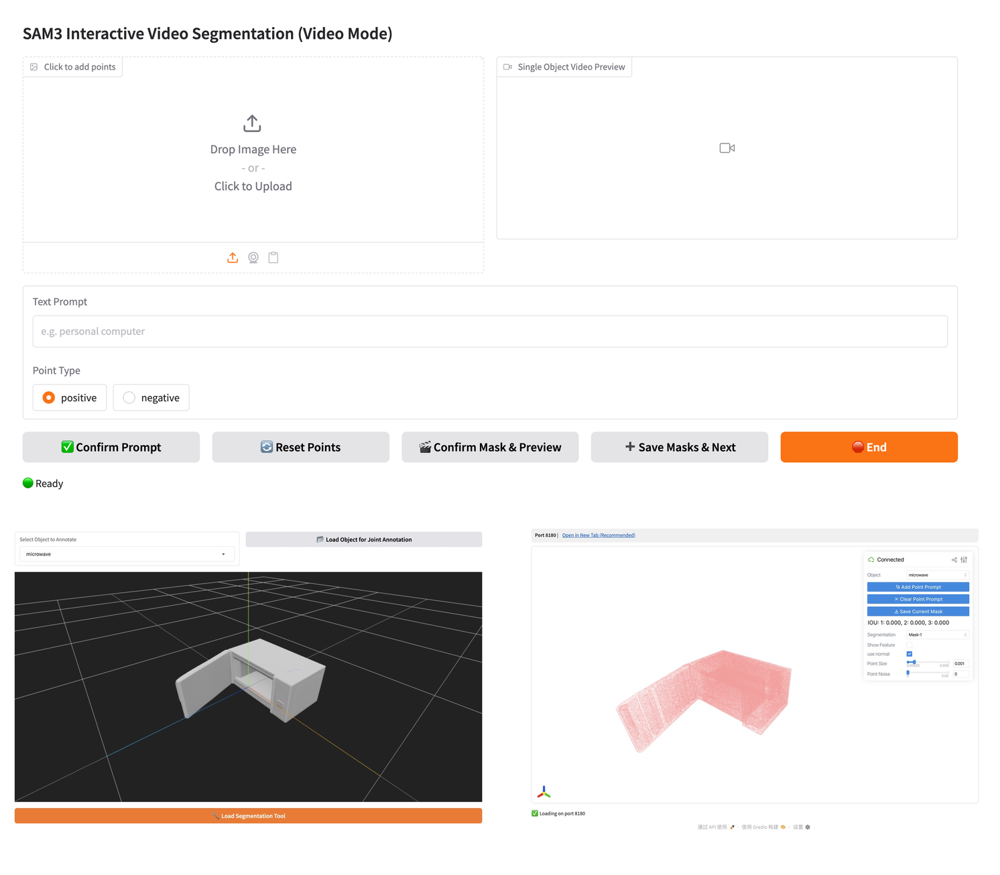

<h1 align="center">
  
</h1>

<p align="center">One-Shot Real-to-Sim Scene Generation for Generalizable Robot Learning and Evaluation</p>

<p align="center">
  <a href="https://robosnap.github.io">Website</a> |
  <a href="robosnap/paper.pdf">Paper</a>
</p>

<p align="center">
  
</p>


RoboSnap reconstructs real-world scenes into simulation-ready assets from single RGB images, and the full implementation also supports videos as input. Our **GUI tool** supports interactive segmentation, mask-to-3D asset generation, scene composition, and articulated-object segmentation. 

We also provide **a fully automatic pipeline** that transforms a single image into a layered simulation-ready scene with object assets and background context within around **20 minutes**.

More components from the paper, including **evaluation code**, **real-robot deployment code**, and the **DROID-Sim** dataset will be released soon **this month (07/26)**. Stay tuned!


## Release Plan

- [x] GUI tool
- [x] Fully automatic layered scene generation pipeline
- [ ] Real-robot deployment tutorial
- [ ] Evaluation code
- [ ] DROID-Sim dataset


## Automatic Pipeline

After installing the full-pipeline environments:

```bash
export GEMINI_API_KEY=<your-api-key>
bash scripts/run_auto_pipeline.sh
```

The default adapter uses Gemini for object detection and semantic background editing. Provider commands and input/output paths can be changed in `configs/auto_pipeline.env`. 

The final outputs include:

```text
outputs/automatic/
  gravity_aligned_background.ply
  fully_refined_foreground.glb
  layered_preview.png
  pipeline_report.json
```

To render an existing result of a compositional scene, use `bash scripts/render_gravity_aligned_scene.sh`.

See [docs/automatic_pipeline_setup.md](docs/automatic_pipeline_setup.md) for model downloads and environment overrides.

<p align="center">
  
</p>

## GUI

The pipeline of our GUI tool includes:

1. Upload a video/image.
2. Add text prompt and positive and negative prompt points.
3. Confirm, preview and save masks.
4. Generate GLB assets and compose a scene.
5. (Optional) Articulated objects segmentation.


<p align="center">
  
</p>

The GUI provides the recommended workflow for mask refinement and asset generation. The mask-to-assets stage can also be executed from an existing mask workspace using:
`scripts/gui/bash/run_mask_to_assets.sh`.

> **Note:** For multi-view asset generation using the top-20 mask candidates, we recommend a GPU environment with at least **48GB of VRAM** to ensure smooth execution.

### Online Demo

We provide an online Gradio demo to showcase the capabilities of the RoboSnap GUI tool.
You can access the demo [here](https://0a1b81dfcc87953981.gradio.live).

It's a preview of the function of the GUI and may expire or be unstable. Deploy the GUI locally for the best performance.

## Environment

### Docker

Prerequisites on the host:

```bash
docker version
nvidia-smi
docker run --rm --gpus all nvidia/cuda:12.1.1-base-ubuntu22.04 nvidia-smi
```

Clone and enter the repo:

```bash
git clone https://github.com/robosnap/robosnap.git
cd robosnap
```

The GUI and fully automatic pipeline can be installed independently.

#### GUI only

Build the image:

```bash
docker build -t robosnap-gui:local .
```

Start the GUI:

```bash
docker run --gpus all --rm -it \
  --ipc=host --shm-size=16g \
  -p 7897:7897 \
  -v "$(pwd)/checkpoints:/workspace/robosnap/checkpoints" \
  -v "$(pwd)/outputs:/workspace/robosnap/outputs" \
  robosnap-gui:local
```

Open:

```text
http://127.0.0.1:7897
```

The default input video is `examples/video.mp4`. The default output workspace is `outputs/example/multi_mask`.

#### Full pipeline only

```bash
docker build -f docker/Dockerfile.auto -t robosnap-auto:local .

docker run --gpus all --rm -it \
  --ipc=host --shm-size=32g \
  -v "$(pwd)/checkpoints:/workspace/robosnap/checkpoints" \
  -v "$(pwd)/outputs:/workspace/robosnap/outputs" \
  robosnap-auto:local --help
```

The image contains the four full-pipeline environments. Model weights remain outside the image under `checkpoints/`.

### Conda

The GUI and fully automatic pipeline can be installed independently.

#### GUI only

The GUI uses three Python runtimes: video segmentation, mask-to-3D asset generation, and the Articulate Tool.

Install them with:

```bash
bash scripts/install.sh
```

The script creates `robosnap-gui`, `robosnap-asset`, and `robosnap-articulate`, then writes `configs/gui.env` so `bash scripts/run_gui.sh` uses the new envs.

After installation:

```bash
bash scripts/run_gui.sh
```

#### Full pipeline only

Install the full-pipeline environments with:

```bash
bash scripts/install_auto_pipeline.sh -y
```

This creates `robosnap-sam3`, `robosnap-asset`, `robosnap-lyra`, and `robosnap-sim`, then writes `configs/auto_pipeline.env`. The GUI environments are not required.


## Checkpoints

Model weights are not committed. `checkpoints/` is the default local mount point and is git-ignored except for `.gitkeep`.

Use the checkpoint helper for Hugging Face downloads. Private or unreleased checkpoint repos must be passed explicitly:

```bash
python3 scripts/gui/python/download_checkpoints.py --skip-optional
python3 scripts/gui/python/download_checkpoints.py --sam3d-repo <your-sam3d-checkpoint-repo>
```

For the full pipeline:

```bash
conda run -n robosnap-asset python scripts/download_auto_checkpoints.py --core
conda run -n robosnap-asset python scripts/download_auto_checkpoints.py --lyra --accept-lyra-license
```

## Configuration

The GUI uses `configs/gui.env`. The full pipeline uses `configs/auto_pipeline.env`, which is written by `scripts/install_auto_pipeline.sh`.

Create a GUI override file only when needed:

```bash
cp configs/gui.env.example configs/gui.env
```


## Folder Structure

The GUI writes a workspace including `multi_mask/` and `single_mask/`:

```text
outputs/example/
  multi_mask/
    video.mp4
    segmented_video.mp4
    background/
      000000.png
    object_name_a/
      all_mask/
      top20_mask/
      object_name_a.glb
      object_name_a_joints.json
      object_name_a_joints.usd
  single_mask/
    image.png
    0.png
    0.glb
    scene_composed.glb
```

## License

The RoboSnap source code is released under the Apache License 2.0.
See the [LICENSE](LICENSE) file for details.

## Third-Party Code and Models

RoboSnap includes adapted third-party components under `third_party/`.
Each component remains subject to its original license and attribution
requirements. Please refer to the corresponding subdirectory for details.

Model checkpoints are not included in this repository and may be subject
to their respective licenses from the original authors.
